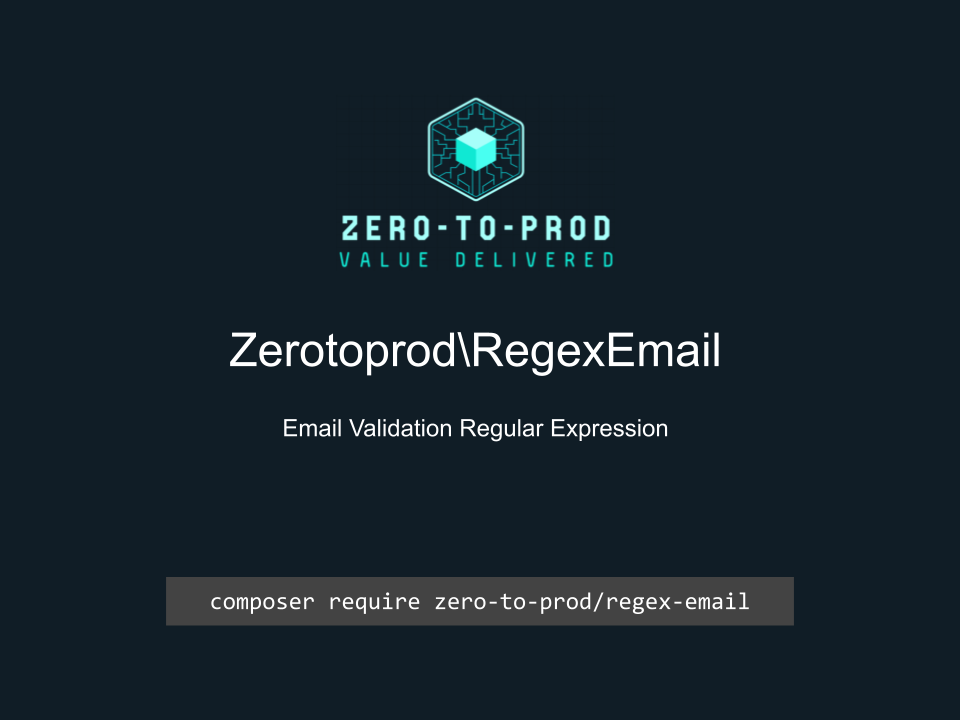

# Zerotoprod\RegexEmail



[](https://github.com/zero-to-prod/regex-email)
[](https://github.com/zero-to-prod/regex-email/actions)
[](https://github.com/zero-to-prod/regex-email/actions)
[](https://packagist.org/packages/zero-to-prod/regex-email/stats)
[](https://packagist.org/packages/zero-to-prod/regex-email/stats)
[](https://packagist.org/packages/zero-to-prod/regex-email)
[](https://github.com/zero-to-prod/regex-email/blob/main/LICENSE.md)
[](https://wakatime.com/badge/github/zero-to-prod/regex-email)
[](https://hitsofcode.com/github/zero-to-prod/regex-email/view?branch=main)

## Contents

- [Introduction](#introduction)
- [Requirements](#requirements)
- [Installation](#installation)
- [Usage](#usage)
- [Local Development](./LOCAL_DEVELOPMENT.md)
- [Contributing](#contributing)

## Introduction

A regular expression to check an Email string.

## Requirements

- PHP 7.1 or higher.

## Installation

Install `Zerotoprod\RegexEmail` via [Composer](https://getcomposer.org/):

```bash
composer require zero-to-prod/regex-email
```

This will add the package to your project’s dependencies and create an autoloader entry for it.

## Usage

```php
Zerotoprod\RegexEmail\RegexEmail::pattern;
```

## Contributing

Contributions, issues, and feature requests are welcome!
Feel free to check the [issues](https://github.com/zero-to-prod/regex-email/issues) page if you want to contribute.

1. Fork the repository.
2. Create a new branch (`git checkout -b feature-branch`).
3. Commit changes (`git commit -m 'Add some feature'`).
4. Push to the branch (`git push origin feature-branch`).
5. Create a new Pull Request.
