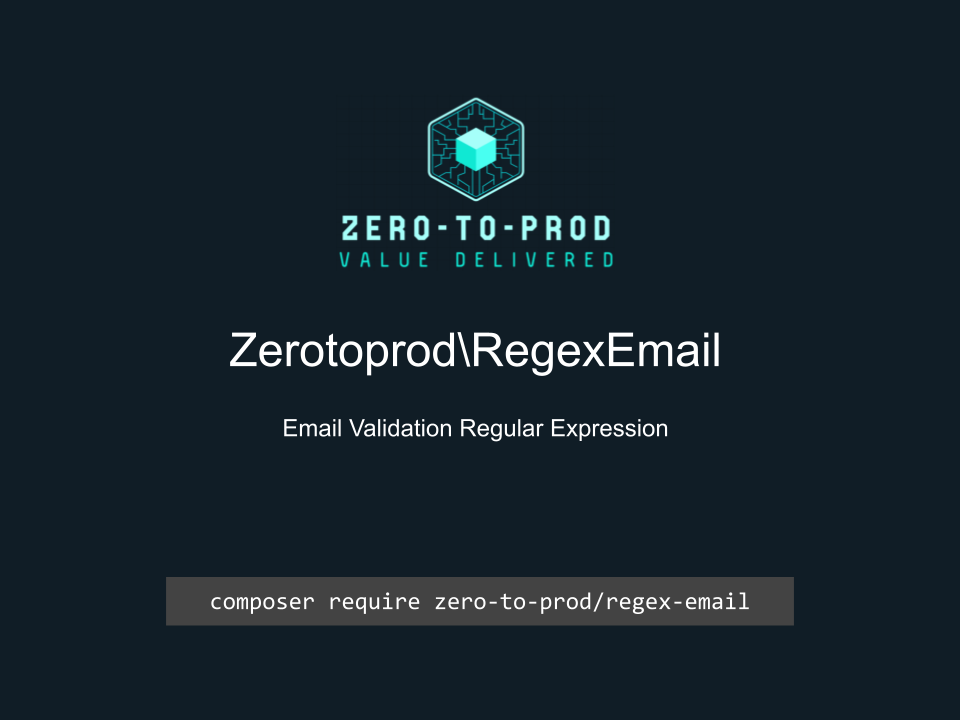

# Zerotoprod\SemverRegex



[](https://github.com/zero-to-prod/regex-email)
[](https://github.com/zero-to-prod/regex-email/actions)
[](https://packagist.org/packages/zero-to-prod/regex-email/stats)
[](https://packagist.org/packages/zero-to-prod/regex-email/stats)
[](https://packagist.org/packages/zero-to-prod/regex-email)
[](https://github.com/zero-to-prod/regex-email/blob/main/LICENSE.md)
[](https://wakatime.com/badge/github/zero-to-prod/regex-email)
[](https://hitsofcode.com/github/zero-to-prod/regex-email/view?branch=main)

A regular expression to check an Email string.

## Installation

Install the package via Composer:

```bash
composer require zero-to-prod/regex-email
```

## Usage

```php
Zerotoprod\RegexEmail\RegexEmail::pattern;
```
